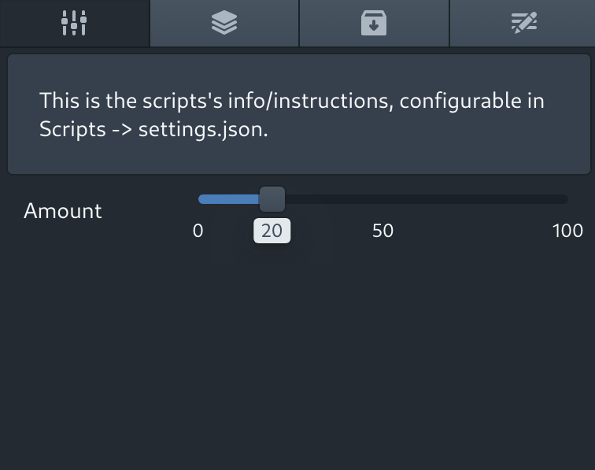

<style type="text/css" rel="stylesheet">img {max-width: 30%}</style>
# Settings

In order for scripts to have user-configurable values, OpenOverlay provides a mechanism for simple, graphical
user input. This avoids the hassle of end users having to modify values within the script, and should be
especially convenient for the less technically-minded user. The `settings.json` file can be created using the
special button in the scripts panel.

### Example `settings.json`
```javascript
{
  "info": "This is the scripts's info/instructions, configurable in Scripts -> settings.json.",
  "initial": { "amount": 25 }, // the default value of each variable (specified by the `name` property)
  "parameters": [
        {
            "name": "amount", // the internal name of the setting - must be a valid variable name
            "type": "slider", // allows the user to graphically select a number between 0 and 100. May also be "text", which produces a text box.
            "displayName": "Amount", // the label given to the input slider (or box) in the UI.
            "inline": true, // whether to render the label next to (true) or above (false) the input slider/box.
        }
  ]
}
```

Once OpenOverlay detects a `settings.json` file, it creates a new panel alongside the Layers, Assets, and Scripts panels:



### Using settings values in scripts
All settings values are exposed to scripts through the top-level property `settings`:
```javascript
console.log(settings.amount) // prints the value of the `amount` setting to the console.
```

Settings values are mutable:
```javascript
settings.amount = 45; // updates the value of the setting, both in the script variable and in the settings UI.
```