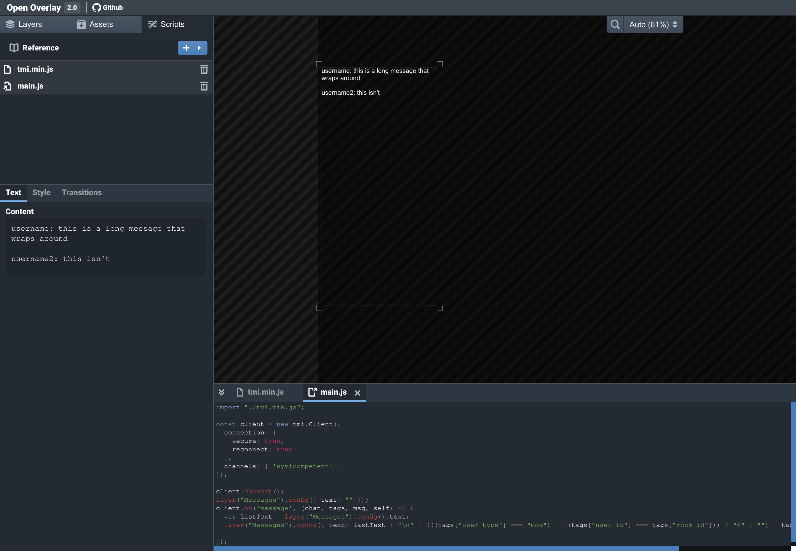

<style type="text/css" rel="stylesheet">img {max-width: 50%}</style>
# Tips and Tricks

### How to make a circle
Because the only shape element included with OpenOverlay is a rectangle, there are a few different
methods to make a circle. For simple uses, a `Rectangle` element can be used with the `Corner Radius`
parameters set to half the relevant side lengths of the rectangle. 


### More complex shapes
HTML5's `<svg>` element can be used to draw complex shapes in a layer. First, make a local HTML file
and title it accordingly. Inside the file, put something like the following:
```html
<svg width=1280 height=720>
    <circle cx=250 cy=250 r=40 />
</svg>
```
Drag the file into the overlay editor. It will create an `IFrame` layer containing your circle,
and the circle will appear inside it:


`IFrame` elements are by default 1280x720 pixels, but this can be changed manually to fit the SVG
drawing you include. The HTML file you created will appear in the Assets tab. 

### Twitch Chat Integration
Connection to Twitch chat is handled with [tmi.js](https://tmijs.com/). To use chat functionality in your
overlay, you can copy the latest version from [here](https://github.com/tmijs/cdn/tree/master/latest) as a new script
in your overlay. It can then be used according to its documentation. For example, to display chat messages
on-screen:



The `main.js` script for the above overlay is copied here. It is very similar to the tmi.js example chat monitor.
```javascript
import "./tmi.min.js";

const client = new tmi.Client({
  connection: {
    secure: true,
    reconnect: true
  },
  channels: [ 'mikesci' ]
});

client.connect();
layer("Messages").config({ text: "" });
client.on('message', (chan, tags, msg, self) => {
  var lastText = layer("Messages").config().text;
  layer("Messages").config({ text: lastText + "\n" + (((tags["user-type"] === "mod") || (tags["user-id"] === tags["room-id"])) ? "@" : "") + tags["display-name"] + ": " + msg});
  
});
```