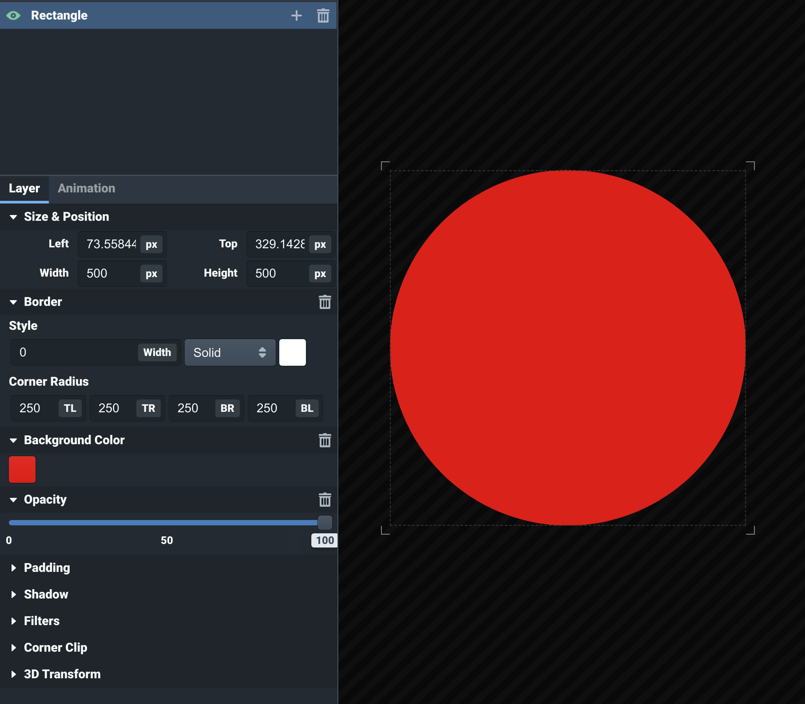
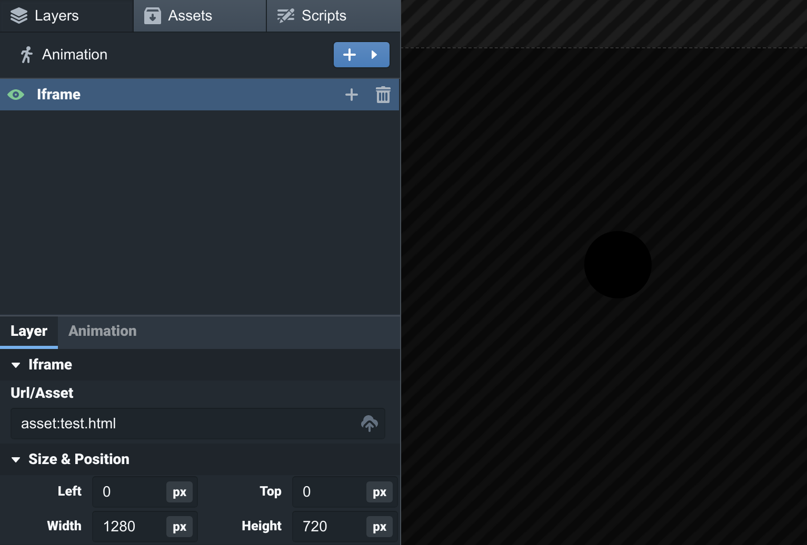

<style type="text/css" rel="stylesheet">img {max-width: 50%}</style>
# Tips and Tricks

### How to make a circle
Because the only shape element included with OpenOverlay is a rectangle, there are a few different
methods to make a circle. For simple uses, a `Rectangle` element can be used with the `Corner Radius`
parameters set to half the relevant side lengths of the rectangle. 



### More complex shapes
HTML5's `<svg>` element can be used to draw complex shapes in a layer. First, make a local HTML file
and title it accordingly. Inside the file, put something like the following:
```html
<svg width=1280 height=720>
    <circle cx=250 cy=250 r=40 />
</svg>
```
Drag the file into the overlay editor. It will create an `IFrame` layer containing your circle,
and the circle will appear inside it:



`IFrame` elements are by default 1280x720 pixels, but this can be changed manually to fit the SVG
drawing you include. The HTML file you created will appear in the Assets tab. 