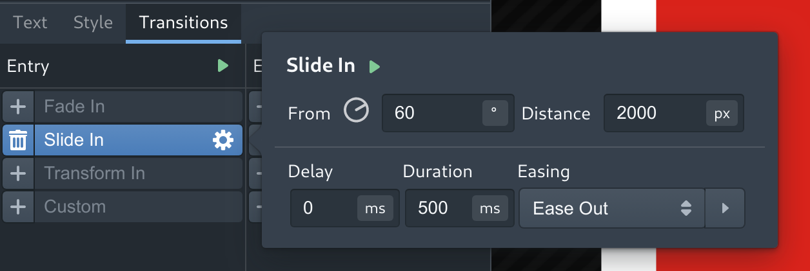

# Basic Transitions

In general, layers with transitions should be thought of as having three defined states: **initial**, **display**, and **final**.
For `entry`-type transitions, the layer is moved from its **initial** values to its **display** values, while `exit`-type
transitions move the layer from **display** values to its **final** values. The **initial** and **final** values are specified
in the transitions tab, while the **display** values are the properties in the **style** tab.

The layer executes the `entry` transition when it becomes visible via script (`LayerSelection.show()`),
and the `exit` transition when it becomes hidden.

Note: Exit animations will <b>not</b> work as expected in OBS. This is because when a browser source is hidden, OBS
unloads the source instantly. In order to animate the exit of a layer in OBS, you will need to use scripting to
hide the layer on some sort of external stimulus (a timer, window event, etc). Hopefully, in the future we will have a
way for overlays to work out of the box in OBS.

OpenOverlay has three built-in transition presets, which can be applied to any layer type:

### Fade
Fade transitions adjust the opacity of the layer percent-wise. 

### Slide
Slide transitions translate the layer's position. The initial or final position of the layer is specified using
an angle in degrees and a distance in pixels:

To make sense of these numbers, imagine the positively-oriented `60°` (counterclockwise) angle, with the vertex
at the display position of the layer. Then, draw a `2000px`-long line segment along this angle. This represents the
position from which the layer will slide in (or the position to which it will slide out).

### Transform
Transform transitions change the rotation (in degrees) and scale (percent-wise) of the layer. 

### Transition Timing
To control the timing of your transitions, there are three parameters:

* `Delay` (ms) - specifies a time to wait between the layer becoming visible (or hidden) before executing the transition.
* `Duration` (ms) - the length of time over which to render the transition.
* `Easing` - the curve representing the rate at which the changes occur. 

There are five built-in easing presets, which can be visualized by clicking the arrow to the right of the dropdown menu.
You can also draw a custom easing curve.