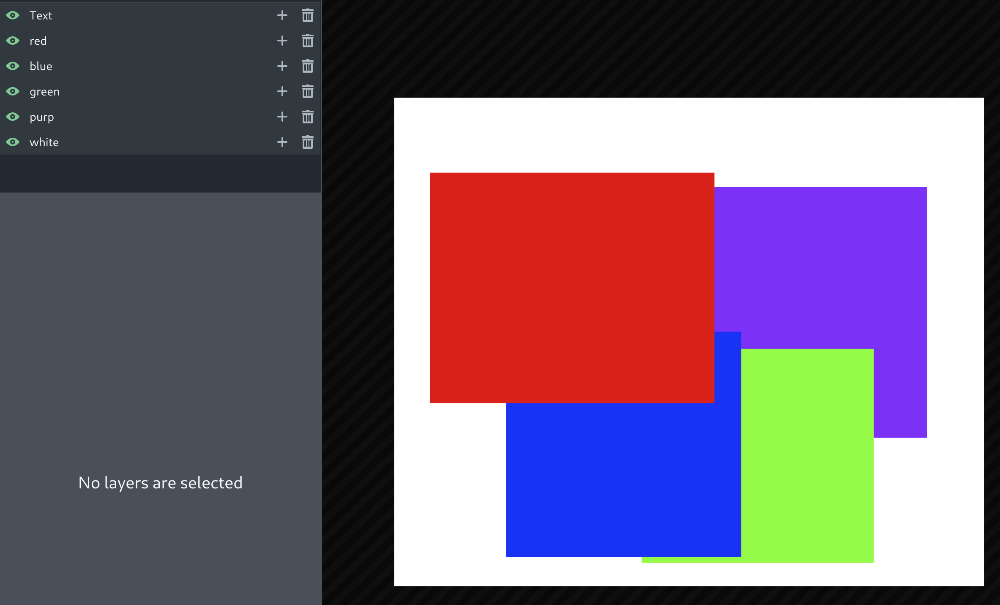
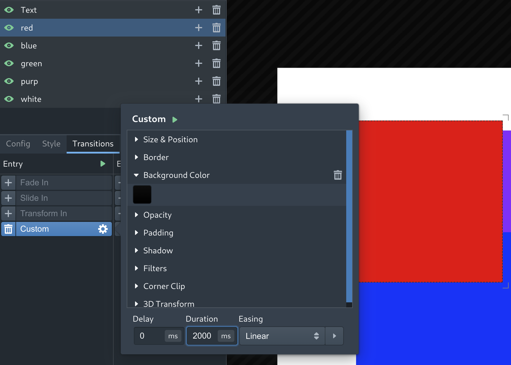

# Custom Transitions

If the basic transition palette is not enough for your needs, you can make your own. The Custom transition type
lets you specify an alternate set of values for any combination of properties specified in the layer's Style tab.
For example, say I have an overlay with these shapes:

and say that I want the red rectangle to be black when the layer is made visible, but fade to red over the course of the
next two seconds. I will select the layer and add a Custom transition. Then I will change the `Duration` property to
`2000` milliseconds, and set the background color to black:

